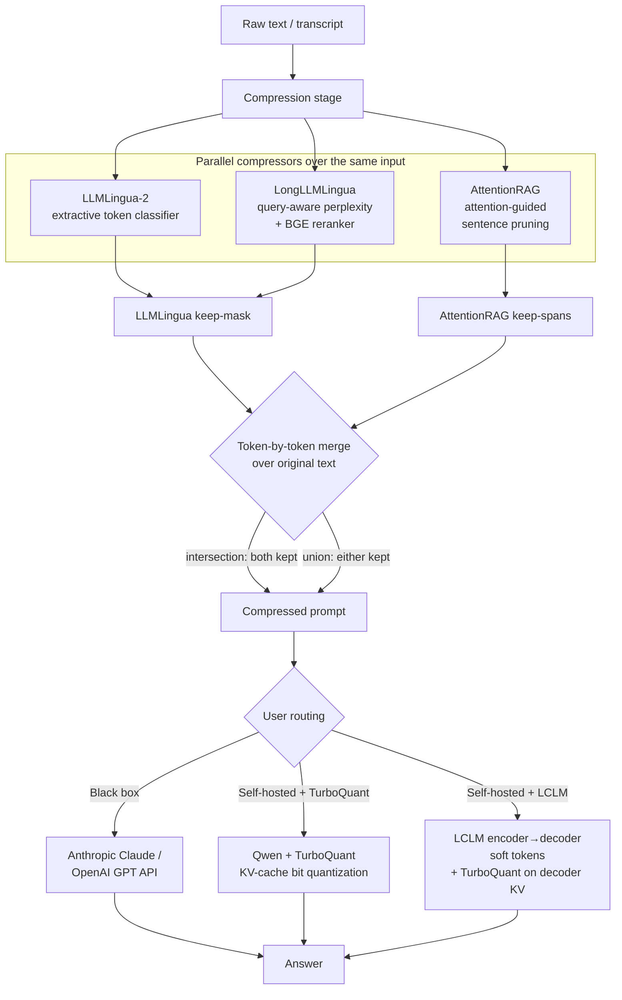

# Winnow

> Voice-first, real-time token compression for LLM pipelines.
> Speak, and we transcribe, prune, and pipe — losing words, keeping meaning.

Winnow is a hackathon project that compresses live speech transcripts in real time before they reach an LLM, demonstrably without losing meaning. Spoken language is verbose; LLM input tokens cost money. Winnow shows you the savings, the diff, and a side-by-side fidelity audit, then lets you talk to the compressed transcript through a Claude-Projects-style workspace.

---

## What it does

Two views, one pipeline.

### Compare
Watch compression happen live. Raw transcript on the left as you speak, pruned transcript on the right within milliseconds of each pause. Pruned words are struck through. A stats bar tracks running token counts, % saved, $ saved per the chosen LLM, average pipeline latency, and a sparkline of compression ratio over time. A built-in A/B Q&A box asks the same question against both transcripts in parallel — when the answers match, you have proof compression preserved the buried details.

### Learn
A voice-first Claude-Projects-style workspace built around the compressed transcript. Tap the mic, talk naturally, each pause auto-sends a chat message. Claude streams answers back. One-tap **Insights** generate a summary, decision log, action items, flashcards (flippable carousel), and glossary — all backed by Anthropic prompt caching so multi-turn sessions stay cheap.

### Stage-safety features
- **Swappable input source.** Live mic and a pre-recorded JSON fixture both implement the same `TranscriptSource` interface. One click swaps them; downstream code can't tell which is active. If the live mic ever fails on stage, the fallback is a literal replay of you doing the demo, with original utterance timing.
- **In-app fixture recorder.** Capture a live session, download as JSON, drop into `public/fixtures/demo-transcript.json` — and your fallback becomes you.
- **Director mode.** Keyboard shortcuts (`Space` start/stop, `R` swap source, `1/2/3` fire preset Q&A probes, `X` clear, `?` show overlay) let you drive the demo without touching a trackpad.

---

## Compression pipeline

Winnow compresses along two orthogonal axes: **token-space** (which words survive,
before the model) and **model-space** (sequence length + KV-cache bit-width, inside
the model). The same input is fanned out to several papers in parallel, their
keep-decisions are merged token-by-token, and the user picks how the compressed
prompt is finally answered.



**Token-space (which words survive).** The text fans out to two compressor
families at once — LLMLingua-2 (+ LongLLMLingua's query-aware reranker/perplexity
arm) and AttentionRAG (attention-guided sentence pruning). Both produce per-token
keep decisions, which Winnow merges token-by-token over the *original* text under a
user-picked boolean rule: **intersection** (keep only if both kept — aggressive) or
**union** (keep if either kept — recall-safe). The merge aligns both methods to one
canonical token sequence rather than doing string membership, and falls back to
LLMLingua-only if AttentionRAG gates everything out.

**Model-space (how it's answered).** The compressed prompt then goes either to a
**black-box API** (Claude / GPT, provider-agnostic), or to our **self-hosted**
workers: **Qwen + TurboQuant** (KV-cache quantized to ~4 bits, 3–4× smaller via a
data-free random-rotation `DynamicCache`), or **LCLM + TurboQuant** — LCLM
compresses the context into a few latent soft tokens (fewer KV *entries*) while
TurboQuant compresses the *bits per entry* of the same decoder cache, so the savings
multiply.

> **Papers:** LLMLingua-2 · LongLLMLingua · AttentionRAG (arXiv:2503.10720) · LCLM /
> End-to-End Context Compression at Scale · TurboQuant (arXiv:2504.19874). We also
> explored CompactPrompt's style-metric approach but it shipped no public dataset to
> reproduce against. A full project write-up lives in [`DEVPOST.md`](DEVPOST.md).

---

## Architecture

```
                  ┌──────────────────────────┐
                  │  Browser (Next.js 15)    │
                  │                          │
   ┌──────────────┤  • Compare tab           │
   │ getUserMedia │  • Learn tab (voice)     │
   │              │  • Zustand store         │
   │              └────────┬──────────┬──────┘
   │                       │          │
   │  WebSocket            │ /api/    │ /api/project-chat
   │  (opus chunks)        │ compress │ /api/project-action
   ▼                       ▼          ▼ /api/qa
┌──────────────┐    ┌──────────────┐    ┌──────────────┐
│  Deepgram    │    │  FastAPI     │    │  Anthropic   │
│  Nova-3      │    │  (server.py) │    │  Claude      │
│  streaming   │    │              │    │  (streaming) │
└──────────────┘    └──────┬───────┘    └──────────────┘
                           │ modal RPC
                           ▼
                    ┌──────────────┐
                    │  Modal       │
                    │  (T4 GPU)    │
                    │  + LLMLingua │
                    │    -2 XLM    │
                    └──────────────┘
```

- The **browser** opens its own WebSocket to Deepgram (auth via `/api/deepgram-token`) and pushes Opus-encoded audio chunks.
- Each `speech_final` utterance fires a request to `/api/compress`, which proxies to the local FastAPI.
- FastAPI calls the **Modal** worker over Modal's RPC. The worker hosts **LLMLingua-2** on a T4, with memory + GPU snapshots so cold starts are ~1 second.
- Q&A and Project chat go through Next.js API routes directly to **Anthropic** (Claude Sonnet 4.6 by default; pickable in the UI).

---

## Tech stack

**Frontend** (`web/`)
- TypeScript, Next.js 15 (App Router), React 18
- Tailwind CSS, Framer Motion, Radix UI primitives (Slider, Switch, Slot)
- Zustand for state, `gpt-tokenizer` for client-side token counting fallback
- `lucide-react`, `canvas-confetti`, `clsx + tailwind-merge`

**Speech**
- Deepgram Nova-3 streaming (interim results, `speech_final`, VAD, diarization, multilingual)

**Compression**
- LLMLingua-2 (`microsoft/llmlingua-2-xlm-roberta-large-meetingbank`)
- Hosted on Modal — T4 GPU, persistent HF cache volume, memory + GPU snapshots for ~1s cold start
- FastAPI / Pydantic / Uvicorn as a thin local proxy

**LLM**
- Anthropic Claude Sonnet 4.6 (default), Opus 4.7, Haiku 4.5; cost math also covers GPT-4o
- Streaming via SSE; prompt caching with `cache_control: ephemeral` on the sources block

---

## Local setup

Prerequisites:
- Python 3.11+
- Node.js 18+
- A Modal account (free tier works)
- A Deepgram API key
- An Anthropic API key

### 1. Set up the Python backend

```bash
# from repo root
python3 -m venv .venv
.venv/bin/pip install --upgrade pip
.venv/bin/pip install modal fastapi "uvicorn[standard]" pydantic
```

### 2. Authenticate Modal and deploy the GPU worker

```bash
.venv/bin/modal setup                          # one-time, opens a browser
.venv/bin/modal deploy llmlingua2_modal.py     # deploys the Compressor class
```

The first deploy takes a few minutes (image build + model download into the persistent volume). Subsequent deploys are near-instant.

### 3. Set up the Next.js frontend

```bash
cd web
npm install
cp .env.example .env
```

Fill in `.env`:
```
DEEPGRAM_API_KEY=...
ANTHROPIC_API_KEY=...
COMPRESS_BACKEND_URL=http://localhost:8000     # default, leave as-is
```

### 4. Run everything

In one terminal — the GPU worker proxy:
```bash
# from repo root
./run.sh                # deploys (if needed) + warms + serves FastAPI on :8000
```
Honors `SKIP_DEPLOY=1` and `SKIP_WARMUP=1` for faster restarts during dev.

In another terminal — the frontend:
```bash
cd web
npm run dev             # http://localhost:3000
```

Open http://localhost:3000.

---

## Using the demo

1. Click **Start** in the top right. The browser asks for mic permission.
2. Talk. Watch the raw column fill on the left, compressed on the right with strike-throughs on dropped words. Stats bar updates live.
3. Hit one of the preset probes under the **Q&A** box (or type a question) — answers fire against raw and compressed in parallel. A green "answers match" badge is the proof.
4. Switch to **Learn**. The compressed transcript is auto-pinned as a source.
5. Tap the big neon mic. Talk to Claude about what was said. Each pause auto-sends. Tap any **Insight** card to generate flashcards, action items, glossary, etc. — results stay cached.

### Stage-safety toggles

- **Live mic ⇄ Recorded** at the top — instant swap. Recorded plays `web/public/fixtures/demo-transcript.json` with original timing.
- **Rec fixture / Save** — capture a fresh recorded fallback from your current live session and download as JSON. Replace `public/fixtures/demo-transcript.json` with it so the fallback is literally you.
- **Director** button or `?` key — pulls up the keyboard cheat sheet.

---

## Troubleshooting

**`Token mint failed: 500` / `403 FORBIDDEN`**
Your Deepgram API key doesn't have project-admin scope, so `/v1/auth/grant` rejects it. Winnow's `/api/deepgram-token` falls back to shipping the raw key to the browser (fine for local). Make sure `DEEPGRAM_API_KEY` is set in `web/.env`. Restart `npm run dev` after editing.

**Chat error: `invalid x-api-key` / `authentication_error`**
`ANTHROPIC_API_KEY` is missing, malformed, or stale. Edit `web/.env`, **then restart `npm run dev`** — Next only reads env vars at boot.

**`backend unreachable` on compress**
FastAPI isn't running. Start it: `./run.sh` from the repo root.

**Modal call fails / cold start is slow**
First call after a deploy or a long idle period builds the GPU snapshot — that's ~30s once, then restores in ~1s. `./run.sh` automatically warms the worker after deploy.

**Port 3000 already in use**
A previous dev server is still up. `lsof -i :3000` to find the PID, then `kill <pid>`. Or use `npm run dev -- -p 3001`.

**Mic not working in the browser**
Browser permission was denied. Chrome / Edge: click the lock icon next to the URL → Site settings → Microphone → Allow.

---

## Repo layout

```
winnow/
├── llmlingua2_modal.py        Modal app: LLMLingua-2 on a T4
├── server.py                  FastAPI proxy: HTTP → Modal RPC
├── warmup.py                  One-shot warm of the deployed worker
├── run.sh                     Deploy + warm + serve, one command
├── web/                       Next.js frontend
│   ├── app/
│   │   ├── page.tsx           Tab host + global controls
│   │   └── api/               compress / deepgram-token / qa / qa-stream / project-chat / project-action
│   ├── components/
│   │   ├── CompareView.tsx    Raw vs compressed two-column view
│   │   ├── LearnView.tsx      Claude-Projects-style workspace
│   │   ├── learn/             Sources, voice chat, insights
│   │   └── ...                StatsBar, SourceToggle, QABox, RateSlider, etc.
│   ├── lib/
│   │   ├── sources/           TranscriptSource interface + live-mic + recorded impls
│   │   ├── pipeline.ts        Wires source → /api/compress → store
│   │   ├── store.ts           Zustand store, totals selector
│   │   └── tokens.ts          Per-model pricing, filler stripper, cost math
│   └── public/fixtures/       Recorded fallback transcript
└── README.md                  ← you are here
```

---

## License

Built for a hackathon. All third-party services and models retain their own licenses.
